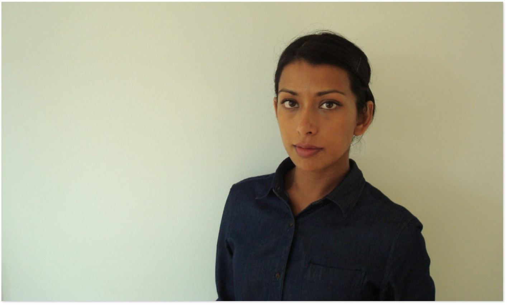

---
# Feel free to add content and custom Front Matter to this file.
# To modify the layout, see https://jekyllrb.com/docs/themes/#overriding-theme-defaults

layout: home

---

I am an associate professor at the [Department of Design and Computation Arts](https://www.concordia.ca/finearts/design.html) at [Concordia University](https://www.concordia.ca/), and [Director of the Technoculture, Art, and Games (TAG) Research Centre](http://tag.hexagram.ca/).

[More about me]( {{ "about" | relative_url }})
